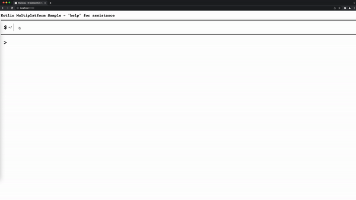

# Kotlin Multiplatform sample

### Tech stack
Full-stack web application using [Kotlin Multiplatform](https://kotlinlang.org/docs/multiplatform.html)
- [Ktor/Kotlin](https://ktor.io/) for backend-side
- [Kotlin/JS for React](https://kotlinlang.org/docs/js-get-started.html) for frontend-side

---

## Getting Started

- Java 17
- Gradle

### Run
- First execute `gradle clean build`
- Execute `gradle run` to start front- and backend part at once
- Open in browser: http://localhost:9090

Note: Ensure that your Gradle and IDE is pointing to the correct Java version. 

---

## Reference
- [Building a Full Stack Web App with Kotlin Multiplatform](https://play.kotlinlang.org/hands-on/Full%20Stack%20Web%20App%20with%20Kotlin%20Multiplatform/01_Introduction)
- [Building Web Applications with React and Kotlin/JS](https://github.com/Kotlin/full-stack-spring-collaborative-todo-list-sample)